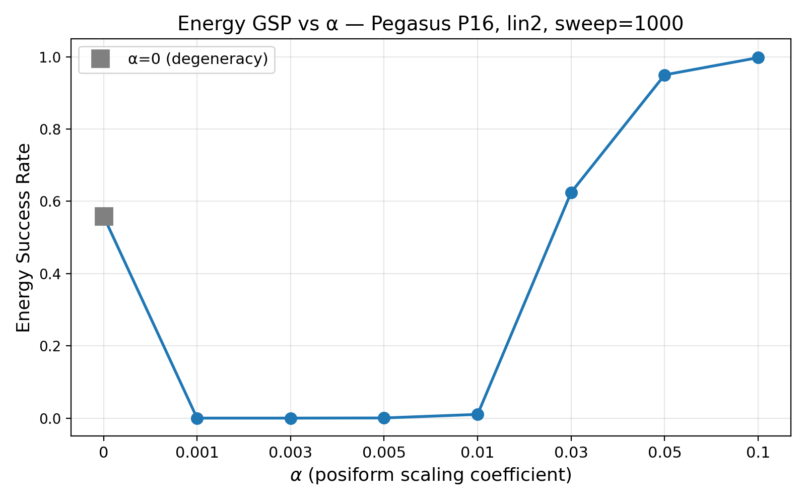

# GSP vs α 실험 결과

**날짜**: 2026-03-25 19:25

## 실험 설정

| 항목 | 값 |
|---|---|
| Topology | Pegasus P16 (n=5640) |
| coeff_type | lin2 |
| α | [0, 0.001, 0.003, 0.005, 0.01, 0.03, 0.05, 0.1] |
| sweep | 1000 (neal default) |
| num_reads | 100 |
| num_instances | 500 |
| 총 소요 시간 | 632.5s |

## GSP vs α

## 에너지 갭 분석

| α | α·Δ_P | Δ_R | ρ = Δ_R/(α·Δ_P) | GSP | 비고 |
|---|---|---|---|---|---|
| 0 | 0 | 1.00 | — | 55.9% | 축퇴 |
| 0.001 | 0.001782 | 1.00 | 561 | 0.0% | |
| 0.003 | 0.005346 | 1.00 | 187 | 0.0% | |
| 0.005 | 0.008910 | 1.00 | 112 | 0.0% | |
| 0.01 | 0.017820 | 1.00 | 56 | 1.0% | |
| 0.03 | 0.053460 | 1.00 | 19 | 62.4% | |
| 0.05 | 0.089100 | 1.00 | 11 | 95.0% | |
| 0.1 | 0.178200 | 1.00 | 6 | 99.7% | |

Δ_P mean = 1.7820, Δ_R mean = 1.00 (500 인스턴스 평균)

## 파일 목록

- `gsp_vs_alpha.png` / `gsp_vs_alpha.pdf` — Fig
- `data.json` — 전체 데이터
- `README.md` — 본 파일
