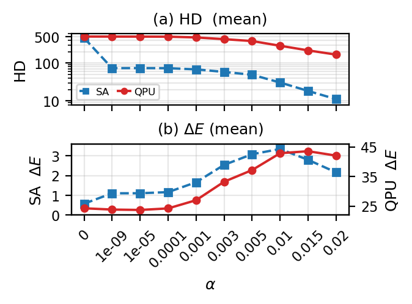
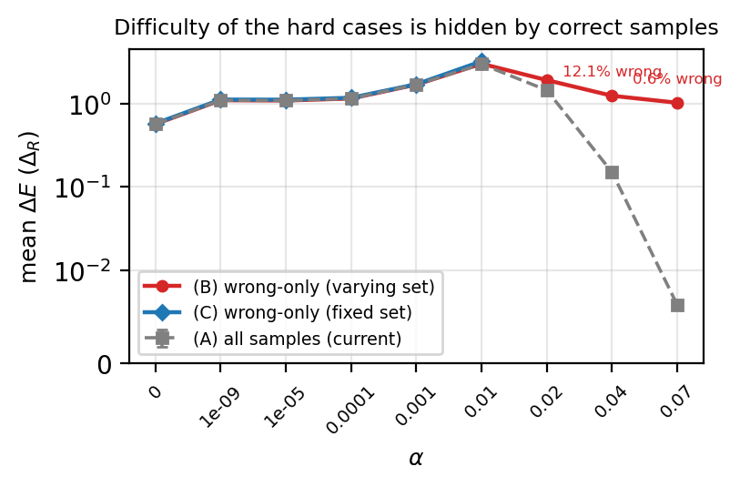

# Posiform-planted QUBO 난이도 분석 — 실험 정리

목적: SA로 posiform-planted QUBO의 난이도를 측정한다. 핵심은 **정답 샘플을 빼고(실패 조건부), 가장 어려운 100개 인스턴스를 고정 집단으로** 통계내는 것이다. 정답을 섞으면 ΔE가 성공률 효과로 0에 붕괴해 실제 난이도가 가려지기 때문이다. (SA·QPU 비교를 위해 이 100개를 두 솔버 공통 집단으로 쓴다.)

지표: 에너지 차 ΔE = E − E_target, 해밍 거리 HD = target과 다른 비트 수. ΔE는 Δ_R=1 단위(lin2라 R 에너지가 정수). 아래 모든 통계는 **실패 샘플(x ≠ target)만** 대상으로 한다.

샘플별 ΔE / HD 계산:

```python
# Q_α = Σ R_i + α·P  (R_sum, P 는 미리 계산된 dict)
def build_Q(inst, alpha):
    Q = dict(inst['R_sum'])
    for k, v in inst['P'].items():
        Q[k] = Q.get(k, 0) + alpha * v
    return {k: v for k, v in Q.items() if abs(v) > 1e-15}

target_energy = inst['t_energy_r'] + alpha * inst['t_energy_p']
resp = sampler.sample_qubo(Q_dict, num_reads=num_reads, num_sweeps=num_sweeps)

for sample, energy, num_occ in resp.data(['sample', 'energy', 'num_occurrences']):
    found_str = ''.join(str(sample[nd]) for nd in sorted_nodes)
    hd = sum(1 for a, b in zip(target_str, found_str) if a != b)   # Hamming distance
    delta = float(energy) - float(target_energy)                   # ΔE
    if found_str == target_str:        # 정답 → 통계에서 제외 (실패 조건부)
        continue
    # 그리고 instance_id 가 고정 100 집단에 속할 때만 집계
```

## 실험 설정

| 항목 | 값 |
|---|---|
| 토폴로지 | D-Wave Advantage Pegasus P16 |
| 활성 큐빗 n | 5612 |
| 계수 타입 | lin2 (R_ij ∈ {−1, +1}) |
| 생성 인스턴스 | 500 |
| 분석 집단 | 그중 가장 자주 실패한 **100개 고정 집단** (SA·QPU 공통) |
| reads / (inst, α) | 100 |
| SA sweeps | 1000 (neal) |
| 블록 분할 | Kernighan–Lin 재귀 이분, 블록 ≤ 16 |
| α (10점) | 0, 1e-9, 1e-5, 1e-4, 1e-3, 3e-3, 5e-3, **1e-2**, 1.5e-2, 2e-2 |

데이터: `results/gsp_fullrun500_..._20260521_173814/` (원본 7점) + `results/gsp_extend500peak_..._20260527_162048/` (peak 부근 3점 추가 측정). 고정 100 집단 = `instances/instances_pegasus16_lin2_hard300.pkl`의 가장 어려운 100개(meta `orig_instance_ids[:100]`).

**왜 α ≤ 0.02 인가**: 그 이상에서는 집단이 정답을 찾아 탈출한다(α=0.04에서 집단의 읽기 중 일부만 실패). 즉 모든 α에서 일관되게 갇힌 고정 집단이 존재하지 않으므로 그 너머(0.04 / 0.07 / 0.1)는 제외했다.

## 결과 — 고정 100 집단, 실패 샘플만

| α | mean HD | HD/n % | mean ΔE (±SEM) | med ΔE |
|---|--------:|-------:|---------------:|-------:|
| 0       | 458.8 | 8.17 | 0.576(8)  | 0.00 |
| 1e-9    |  73.5 | 1.31 | 1.102(11) | 1.00 |
| 1e-5    |  73.8 | 1.31 | 1.104(11) | 1.01 |
| 1e-4    |  73.2 | 1.30 | 1.161(11) | 1.07 |
| 1e-3    |  68.3 | 1.22 | 1.661(11) | 1.59 |
| 3e-3    |  58.4 | 1.04 | 2.541(11) | 2.36 |
| 5e-3    |  49.2 | 0.88 | 3.079(12) | 2.93 |
| **1e-2** | **30.7** | 0.55 | **3.345(14)** | **3.20** |
| 1.5e-2  |  18.4 | 0.33 | 2.792(14) | 2.64 |
| 2e-2    |  11.2 | 0.20 | 2.160(13) | 1.92 |

100개 인스턴스 전부가 표시된 모든 α에서 실패한다(읽기의 91% 이상). 같은 비단조 형태는 인스턴스 500개 전체에서도 나타나, 최난해 100개 선정이 만든 인공물이 아니다.



그림 1. 고정 100 집단의 실패 샘플 난이도. 파랑: SA(1000 sweeps), 빨강: D-Wave Advantage 양자 어닐러(동일 100개, 교차검증). (a) HD 로그축 — 둘 다 단조 감소(SA 459→11)하나 0에 닿지 않는다. (b) ΔE 이중축(좌 SA / 우 QPU) — SA는 Δ_R 바닥(≈1)에서 αP 정점(α=0.01, 3.35)을 거쳐 하강하고, QPU도 한 자릿수 큰 바닥 위에서 같은 형태를 재현한다.

해석:
- **α=0**: P가 없어 최저 에너지 상태가 여러 개(축퇴). 샘플 56.1%가 그중 하나에 도달해 ΔE 중앙값 0, 그러나 HD는 459(최대) — 에너지로는 바닥이어도 비트열은 target과 멀다.
- **Δ_R 바닥**: valley(1e-9~1e-4)에서 ΔE 중앙값이 정확히 1 = 순수 R-trap 한 칸 깊이. αP가 너무 작아 에너지에 안 보인다.
- **αP 정점**: α가 1e-3을 넘으며 planted 항이 켜져 ΔE가 상승, **α=0.01에서 3.35**(바닥의 3.0배)로 정점 후 하강. ΔE = ΔR + αP 분해가 그대로 보인다.
- **HD 단조 vs ΔE 정점**: 실패는 비트로는 target에 가까워지면서(HD 감소) 에너지로는 더 깊어진다(ΔE 상승). 같은 실패를 두 지표가 반대로 본다.

## 왜 실패 샘플만 + 고정 집단인가



그림 2. ΔE 세 가지 정의 비교. (A 회색) 전체 샘플 — α 커지면 0으로 붕괴. (B 빨강) 실패만, 가변 집단. (C 파랑) 실패만, 고정 집단.

- **전체 샘플은 난이도를 숨긴다**: 큰 α에서 전체평균 ΔE가 0에 가까워 "거의 다 풀림"처럼 보이지만, 이는 trap이 얕아져서가 아니라 성공률이 올라서다. 실패 샘플만 보면 남은 틀린 케이스는 여전히 깊다.
- **고정 집단이 필요한 이유**: 실패 집단을 그때그때 쓰면(B) α마다 구성이 달라져(생존편향) 정점이 희석된다. 가장 어려운 100개를 고정하면(C) 모든 α에서 같은 집단(읽기 91% 이상 실패)이라 비교가 공정하고 정점이 더 선명하다.

## 실험 2 — SA 예산 비교

성공률로는 구분되지 않는 두 SA 설정을 ΔE가 가를 수 있는지 확인(150 인스턴스 부분집합).

| α | sweeps | 성공률 | mean ΔE |
|---|-------:|------:|--------:|
| 1e-5 | 1000 | 0% | 1.09 |
| 1e-5 | 5000 | 0% | 0.40 |
| 1e-3 | 1000 | 0% | 1.68 |
| 1e-3 | 5000 | 0% | 1.00 |

valley(작은 α)에서 1000·5000 sweeps 모두 성공률 0%로 같지만 mean ΔE는 뚜렷이 갈린다 — 성공률이 못 하는 솔버 순위를 ΔE가 매긴다.

## 재생성

```bash
# SA 새 α 추가 측정 (peak 부근)
python3 extend_alphas.py --pkl instances/instances_pegasus16_lin2_500.pkl \
  --alphas 0.003,0.005,0.015 --workers 4 --out_tag extend500peak

# 고정 집단 난이도 분석 + 세 가지 ΔE 정의 비교 그림
python3 analyze_hard300.py          # 집단 랭킹·fig_traj·로스터
python3 compare_difficulty.py       # fig_compare_difficulty (세 가지 ΔE 정의)

# SA vs QPU overlay (동일 100개, 논문 Fig 1)
python3 make_overlay.py             # → figures/fig_sa_vs_qpu.{png,pdf}
```
